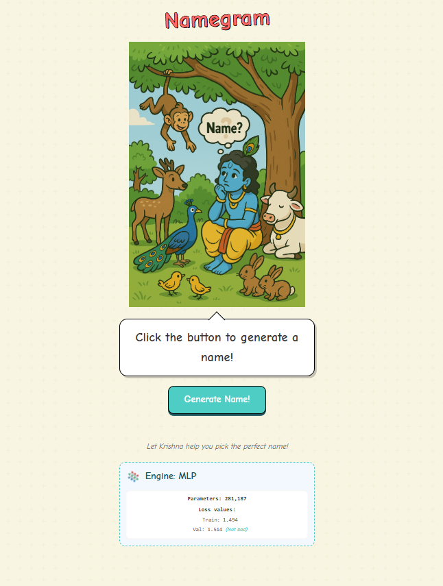

# Namegram - Name Generator

A fun and interactive name generator web application built with Flask that lets Krishna help you pick the perfect name! 

  

## Features

- One-click name generation
- Beautiful animations and visual effects
- Collection of culturally meaningful Indian names
- MLP (Multi-Layer Perceptron) engine with 281,187 parameters

